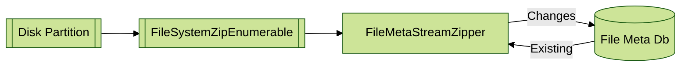
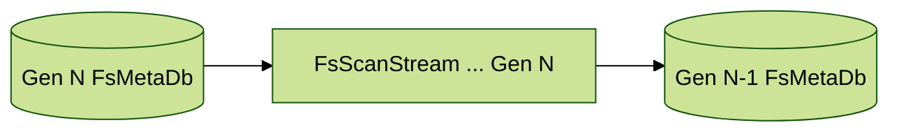

**FsMetastore** is a C# library that captures file system metadata into formats suitable for transfer. 
It uses two different storage formats to achieve efficiency in collection and transfer.  

It is often impractical to centralize the storage of all file data from all systems.  But,
by centralizing the file metadata from those systems (where it is impractical to centralize 
all files), we can chose the files that we want to pull.  Also, we have more options in
how files are archived:
 - encryption 
 - compression
 - content addressed storage system (perkeep etc)

FsMetastore provides a means to package file metadata and change information so that it can
be delivered centrally.

## Key features:
* Captures basic file system attributes:
  * Name 
  * FileLength
  * ModifiedDate
  * PermissionMask (Optional)
  * OwnerId (Optional)
  * GroupId (Optional)
* Extended Attributes (Optional)
  * Attributes are described in a JsonFile and linked using a 16 bit integer.
  * Attribute data is stored in a separate file, linked to file data using FileId
  * ContentHash (Sha256, CityHash64)
* Transfer format is based on Protobuf (named MetaStream)
  * Content is 
* Sqlite database (FsMetaDb)
    * IEnumerable that includes changes since last scan (New/Deleted/Updated files)
    * Can import/export changes as MetaStream
    * Each file/folder has a 32bit integer Id which is unique per filesystem.  
    * Identifies Drives with a a Guid. 
* It is a netstandard2.0 library written in c#
* Faster (5x to ~10x) to read the metadata file (uncompressed) compared to the native windows 10 file system.
    - not exactly challenging, opportunity for significant improvements remain.
* Uses DirectoryInfo to enumerate file system, roughly 2-3min to read 2.5M files
    - Comparable but slower than [Everything](https://www.voidtools.com/faq/#how_long_will_it_take_to_index_my_files)

## Limitations/Status
The core database doesn't support complex indexes or queries and isn't designed for that purpose.  
Support for capturing complex metadata isn't currently implemented 
- Application Metadata such as exif, mp3 etc
- Content Hash (Sha256)
- Thumbnails
- Inter-file relationships (ie file.cr2=>file.jpg)

## Usage:

### 1. Update Drive Meta DB
The FileMetaStreamZipper reads from FileSystemZipEnumerable and existing FsMetaDb at the same time to
produce a new Enumerable with changes.  

### 2. Update Drive Meta DB
FsMetaDb can export change information in a Protobuf format (FsScanStream) that can then be imported
into a remote FsMetaDb to achieve synchronization.  

## FsMetaDb.
FsMetaDb is a sqlite database structure that contains filesystem information for a single drive (or part thereof). 
It contains 2 main tables

#### FolderMeta
| Column             | Type           | Purpose             | IsCore         | 
| --------------     | -------------- |               -----:|          -----:| 
| Id                 | INTEGER (PK)   |                     | Yes            |
| ParentId           | INTEGER        | Hierarchy Reference | Yes            |
| Ord                | 64bit INTEGER  | Ordering Index      | No             |
| Name               | TEXT           |                     | Yes            |
| SurrogateId        | INTEGER        | Universal Folder Id | Yes            |
| ModifiedDate       | INTEGER        | Unix timestamp (ms) | Yes            |
| PermissionMask     | INTEGER        | Bitmask Attributes  | Yes            |
| OwnerId            | INTEGER        | Id of Owner (user)  | Yes            |
| GroupId            | INTEGER        | Group Owner (user)  | Yes            |
| CreatedGeneration  | INTEGER        | Scan Id created     | No             |
| ModifiedGeneration | INTEGER        | Scan Id changed     | No             |

#### FileMeta
| Column             | Type           | Purpose              | IsCore         | 
| --------------     | -------------- |                -----:|          -----:| 
| Id                 | INTEGER (PK)   |                      | Yes            |
| ParentId           | INTEGER        | FolderMeta Reference | Yes            |
|                    |    | | No            |
| Name               | TEXT           |                      | Yes            |
| FileLength         | INTEGER        |                      | Yes            |
| SurrogateId        | INTEGER        | Universal File Id    | Yes            |
| ModifiedDate       | INTEGER        | Unix timestamp (ms)  | Yes            |
| PermissionMask     | INTEGER        | Bitmask Attributes   | Yes            |
| OwnerId            | INTEGER        | Id of Owner (user)   | Yes            |
| GroupId            | INTEGER        | Group Owner (user)   | Yes            |
| CreatedGeneration  | INTEGER        | Scan Id created      | No             |
| ModifiedGeneration | INTEGER        | Scan Id changed      | No             |

### FsScanStream.
The diff format is a custom binary format that stores file system entries in a lexicographical order. See 
[ScanDB Format](MetaStream.md) for a discussion on the options and current solutions.

### Ord - Hierarchical ordering.
The Sqlite db needs to sort files lexicographically based on their path. This is achieved by adding a 64bit int
column that is calculated with a recursive function.  See [Ord - Hierarchical ordering](Ord.md) for a discussion 
on the options and current solutions.

## Todo
1. Detect changes to length and other attributes.
1. Store Batch as zip file containing:
    - BatchSource
    - Generations
    - Files
    - Folders
1. Add/Remove sqlite indexes as needed to improve performance.
1. Add extra file metadata stream (protobuf?)
1. Remove BatchSourceProvider
1. Add fuzz test for importer by scatterng a combination of file changes into a directory
  - new file/folder at start/middle/end of folder
  - deleted file at start/middle/end of folder
  - test Importing into same folder 2nd time
    - Load A
    - Load A/b.txt             (Add B)
    - Load A/b.txt + A/c.txt   (Add C)
    - Load A/c.txt             (Remove B)
